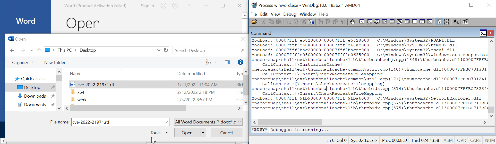

# CVE-2022-21971: Uninitialized pointer free in prauthproviders

<p align='center'>

</p>

## Root-cause

The `WapAuthProvider::CreateInstance` constructor allocates and initializes a `WapAuthProvider` object (0x78 bytes) but it fails to initialize completely its state.

The pointer at offset 0x50 is uninitialized and free'd when the destructor is invoked (in `WapAuthProvider::~WapAuthProvider`):

```
prauthproviders!WapAuthProvider::~WapAuthProvider+0x38:
00007ffd`a91f3078 488b4b50        mov     rcx,qword ptr [rbx+50h] ds:000001cf`efe35fd0=c0c0c0c0c0c0c0c0

0:011> 
prauthproviders!WapAuthProvider::~WapAuthProvider+0x3c:
00007ffd`a91f307c 4883634000      and     qword ptr [rbx+40h],0 ds:000001cf`efe35fc0=0000000000000000

0:011> 
prauthproviders!WapAuthProvider::~WapAuthProvider+0x41:
00007ffd`a91f3081 48ff1578ad0000  call    qword ptr [prauthproviders!_imp_LocalFree (00007ffd`a91fde00)] ds:00007ffd`a91fde00={KERNELBASE!LocalFree (00007ffd`ccdb0620)
```

This is the function using the uninitialized data, see `[0]` and `[1]`:

```c++
void WapAuthProvider::~WapAuthProvider(__int64 this) {
  void *v2; // rcx
  void *v3; // rcx

  *(_QWORD *)this = &WapAuthProvider::`vftable';
  LocalFree(*(HLOCAL *)(this + 56));
  v2 = *(void **)(this + 64);
  *(_QWORD *)(this + 56) = 0i64;
  LocalFree(v2);
  v3 = *(void **)(this + 80);       // <-- [0] uninitialized
  *(_QWORD *)(this + 64) = 0i64;
  LocalFree(v3);                    // <-- [1] free
  *(_QWORD *)(this + 80) = 0i64;
}
```

## Repro

1. Turn on PageHeap via Gflags on `winword.exe`
1. Start Word, attach a debugger to it
1. Open `cve-2022-21971.rtf` in Word

```
(1c84.11b4): Access violation - code c0000005 (first chance)
First chance exceptions are reported before any exception handling.
This exception may be expected and handled.
verifier!AVrfpDphFindBusyMemoryNoCheck+0x8a:
00007ffd`78d84742 817ac0bbbbcdab  cmp     dword ptr [rdx-40h],0ABCDBBBBh ds:c0c0c0c0`c0c0c080=????????

0:011> kc
 # Call Site
00 verifier!AVrfpDphFindBusyMemoryNoCheck
01 verifier!AVrfpDphFindBusyMemory
02 verifier!AVrfpDphFindBusyMemoryAndRemoveFromBusyList
03 verifier!AVrfDebugPageHeapFree
04 ntdll!RtlDebugFreeHeap
05 ntdll!RtlpFreeHeap
06 ntdll!RtlpFreeHeapInternal
07 ntdll!RtlFreeHeap
08 KERNELBASE!LocalFree
09 prauthproviders!WapAuthProvider::~WapAuthProvider
0a prauthproviders!WapAuthProvider::`vector deleting destructor'
0b prauthproviders!WapAuthProvider::Release
0c prauthproviders!CClassFactory::CreateInstance
0d combase!CServerContextActivator::CreateInstance
0e combase!ActivationPropertiesIn::DelegateCreateInstance
0f combase!CApartmentActivator::CreateInstance
```

I've reproduced this on a Windows 10 x64 VM and on Windows 11 x64 with both Wordpad (but requires one click) and Office Word 2019.
